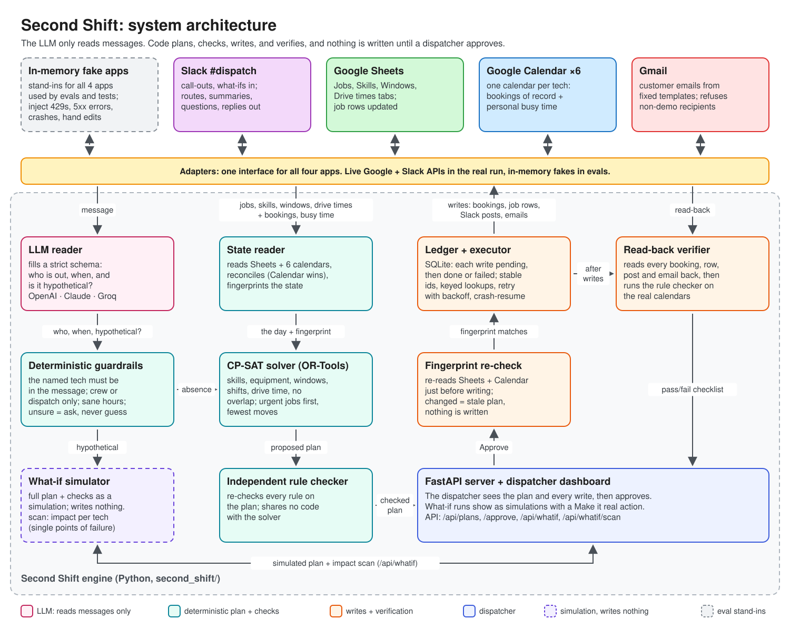
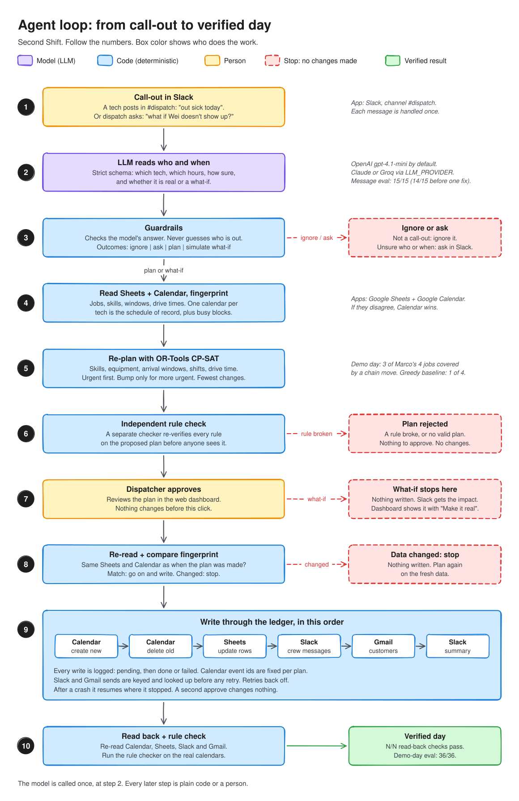
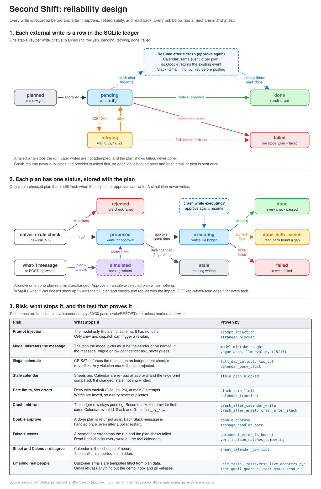

# Second Shift

**We can't predict the day. We can be ready for it.**

When a field technician calls out sick, Second Shift re-plans the whole crew's day across **Slack, Google Sheets, Google Calendar, and Gmail**, then proves the new day is right.

**▶ Demo video (1:43):** [watch on YouTube](https://youtu.be/5mTIo7e090A) · [download (subtitled)](https://github.com/anirxdh/second-shift/raw/main/video/release/SecondShift-final.mp4) · [no-subtitles version](https://github.com/anirxdh/second-shift/raw/main/video/release/SecondShift-final-nosubs.mp4) · [captions .srt](video/release/SecondShift-final.srt)

Built for the Multi-App AI Agent Hackathon, September 13, 2026.

## Overview

It's 6:45 AM. Marco, one of only two gas-certified HVAC techs, calls in sick. Four customers expect him, including an 11:00 contract job. A dispatcher has an hour to reshuffle everyone by hand.

Second Shift does it in seconds:

1. **Hears** the call-out in Slack. An LLM turns the message into a strict schema. That is all the model does.
2. **Reads** jobs, skills, and promised arrival windows from Sheets, and every tech's real day from Calendar.
3. **Re-plans** the crew with a constraint solver (OR-Tools CP-SAT), then an **independent checker** re-verifies every rule.
4. **Waits for a dispatcher to approve**, re-reads Sheets and Calendar, and stops if anything changed.
5. **Writes** to all four apps through an idempotent ledger, then **reads everything back** to prove it.

It also answers **"what if Wei doesn't show up?"** with a simulation that writes nothing, and scans the crew for **single points of failure**.

## External apps

| App | Reads | Writes |
|---|---|---|
| **Slack** `#dispatch` | Call-outs and what-if questions | Replies, each tech's new route, the dispatch summary |
| **Google Sheets** | Jobs, skills, equipment, promised windows, drive times | Job rows: new tech, time, status |
| **Google Calendar** (one per tech) | Bookings (schedule of record) and personal busy time | Moved bookings |
| **Gmail** | Sent mail (to confirm delivery) | Customer notices and reschedule requests |

LLM: OpenAI `gpt-4.1-mini` by default; Claude (`claude-opus-5`) or Groq via `LLM_PROVIDER`.

## How it works





Editable sources: [architecture](docs/diagrams/architecture.excalidraw) · [agent loop](docs/diagrams/agent-loop.excalidraw) · [reliability](docs/diagrams/reliability.excalidraw) (open in excalidraw.com).

| Decision | Made by |
|---|---|
| Who is out, and when | LLM, strict structured output |
| Is that reading trustworthy | Code: the named tech must appear in the message, the sender must be crew or dispatch, else it asks a question |
| Who does which job, when | CP-SAT: skills, equipment, windows, shifts, drive time, no overlaps |
| Is the plan legal | Independent checker (shares no code with the solver) |
| Should it happen | The dispatcher |
| What customers are told | Templates filled from plan data, never model text |

**Demo day result:** the solver covers 3 of Marco's 4 jobs with a chain move. Wei's plumbing job goes to Ana, which frees Wei for the 11:00 gas contract. The fourth job has no legal slot, so that customer gets an honest reschedule request. A careful greedy dispatcher covers 1 of 4.

## How we tested reliability



| Test | Result | Reproduce |
|---|---|---|
| Reliability scenarios (crash mid-run, rate limits, stale calendar, double approve, prompt injection, what-if never writes, ...) | **30/30 pass** | `uv run python -m evals.run` → [REPORT](evals/REPORT.md) |
| Message understanding (real Slack phrasings, incl. injection and vague messages) | **15/15** on `gpt-4.1-mini` (14/15 before one rule fix) | `uv run python -m evals.llm_eval` → [REPORT](evals/LLM_REPORT.md) |
| Live run on real Google + Slack | **36/36** read-back checks, every run from a clean seed, about 30 to 40 s, 0 retries | see Setup |
| All tests: 30 scenarios + 74 adapter unit tests (Google, Slack, Gmail guard) | **104 pass** | `uv run pytest -q` |
| Single points of failure today | Marco, Jordan, Wei | `uv run python -m evals.preparedness` → [REPORT](evals/PREPAREDNESS.md) |

Every scenario runs the same engine, solver, checker, and ledger as the live system, against in-memory apps that inject faults. Every live run leaves a step-by-step trace in the dashboard.

## Setup

**1 minute, no accounts (in-memory apps; needs Python 3.12 and [uv](https://docs.astral.sh/uv/)):**

```bash
uv sync
uv run uvicorn second_shift.server:app --port 8000
```

Open http://localhost:8000, pick Marco under *Plan manually*, click **Plan**, then **Approve**. Try **What if?** and **Risk scan** in the board header, and the **Reliability lab** to crash it on purpose.

**Live (real Google + Slack, free tiers):**

1. Create the accounts in [SETUP.md](SETUP.md) and fill `.env` from `.env.example`.
2. `uv run python scripts/check_setup.py` (every line should say PASS)
3. `uv run python scripts/seed_live.py` (Jobs sheet + one calendar per tech)
4. `SECOND_SHIFT_MODE=live uv run uvicorn second_shift.server:app --port 8000`
5. In Slack `#dispatch`: *"Marco just called, he's out sick all day"*, or *"What if Wei doesn't show up?"*

## More

- [System and reliability brief](docs/BRIEF.md) · [Brand](docs/BRAND.md)
- [The 40 ideas we ranked before choosing this one](ideas/40-hackathon-ideas.md) · [Sponsor and judge research](reference/README.md)
- Stack: Python 3.12, FastAPI, OR-Tools, SQLite, Google APIs, Slack SDK, OpenAI / Anthropic SDKs; vanilla JS pixel dashboard
- Limits: one technician per message; drive times from a zone table, not a routing API; the demo company is synthetic and customer emails go to aliases of the demo inbox
