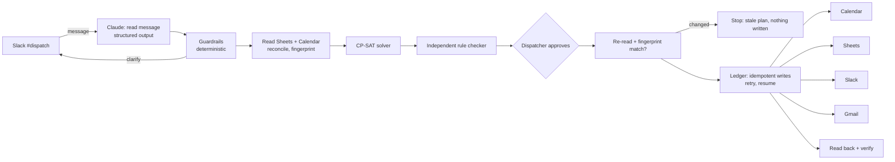

# Second Shift: system and reliability brief

## The problem

A small home-services company runs on a spreadsheet, a shared calendar, Slack, and email. When a technician calls out sick at 6:45 AM, a dispatcher has about an hour to re-plan the day by hand: find someone with the right certification who can still reach each customer inside the arrival window they were promised, avoid double-booking anyone, tell the crew, and email the customers whose visit changed. It's slow, stressful, and easy to get wrong.

## What Second Shift does

1. **Hears the call-out** in Slack `#dispatch` ("Woke up with a fever, can't make it in today").
2. **Reads the day** from **Google Sheets** (jobs, skills, promised windows, drive times) and **Google Calendar** (one calendar per technician: the schedule of record, plus personal busy time).
3. **Re-plans** with a constraint solver (OR-Tools CP-SAT). It can make chain moves: to cover Marco's gas-furnace job, it moves Wei's plumbing job to Ana so that Wei, the only other gas-certified HVAC tech, is free.
4. **Checks** the plan with an independent rule checker that shares no code with the solver.
5. **Waits for a dispatcher to approve** in the web app, which shows exactly which writes will happen.
6. **Re-reads Sheets and Calendar** right before writing. If anything changed since the plan was made, it writes nothing and asks for a re-plan.
7. **Acts** in all four apps: moves Calendar bookings, updates the Jobs sheet, posts each affected tech their new route in **Slack**, and emails affected customers through **Gmail**. Then it **reads everything back** and shows a pass/fail checklist.

## Architecture

## Who decides what

| Decision | Made by | Why |
|---|---|---|
| Is this message a call-out? Who, and which hours? | Claude (structured output, fixed schema) | Language is messy: "car broke down, in by noon" |
| Is that reading trustworthy? | Code: the named tech must exist and literally appear in the message (or be the sender); the sender must be crew or dispatch; the times must be sane | The model can be wrong; the code refuses to guess and asks instead |
| Who does which job, and when | CP-SAT solver | Skills, equipment, promised windows, shifts, drive times, and no overlaps are hard rules, not suggestions |
| Is the plan legal? | Independent checker (separate code) | A solver bug can't hide itself |
| Should it happen? | The dispatcher | People's days and customer promises change |
| What customers are told | Fixed templates filled from plan data | An email can't state a time the plan doesn't contain, and Slack text can't be injected into it |

## Reliability mechanisms

| Risk | Mechanism | Tested by |
|---|---|---|
| Model misreads who is out | Name must appear in the message; unknown senders can't trigger plans; low confidence asks a question | `model_mistake_caught`, `stranger_blocked`, `vague_asks`, message eval |
| Prompt injection | The model only fills a schema; the action set is fixed; emails are templates | `prompt_injection`, message eval |
| Illegal schedule | Solver hard constraints plus an independent checker on the plan and again on the real calendars afterwards | all Planning scenarios |
| Someone edits Calendar while the plan awaits approval | Fingerprint of Sheets + Calendar at plan time, re-checked before the first write | `stale_plan_blocked` |
| Rate limits, 5xx errors | Retries with backoff, per write | `slack_rate_limit`, `calendar_transient` |
| Process dies mid-run | Ledger of every write (pending, then done); Calendar ids are deterministic per plan; Slack and Gmail writes carry a key the engine looks up before retrying | `crash_after_calendar_write`, `crash_after_email`, `crash_after_slack` |
| Double-click on Approve | Plan status plus ledger make approval idempotent | `double_approve` |
| Hard failure | Stops, pins the failing write, never reports success | `permanent_error_is_honest` |
| "Success" that isn't | Read-back of every booking, sheet row, Slack post and email, plus the rule checker on the real calendars | `verification_catches_tampering` |
| Sheet and Calendar disagree | Calendar is the schedule of record; conflicts are reported | `sheet_calendar_conflict` |
| Emailing real people during a demo | The Gmail adapter refuses any address that isn't a plus-alias of the demo inbox | unit test |

Every run leaves a step-by-step trace (read, parse, guard, solve, check, re-check, each write with attempts, verify) with timings, shown in the app.

## Evaluation results

- **Reliability scenarios: 26/26 pass** (`uv run python -m evals.run`, report in `evals/REPORT.md`). They run the same engine, solver, checker, ledger, and sheet-parsing code as the live run, against in-memory stand-ins for the four apps that can inject faults.
- **Message understanding: _TBD_/15** real-world messages led to the right decision: plan, ask, or ignore (`uv run python -m evals.llm_eval`, report in `evals/LLM_REPORT.md`).
- **Solver vs a careful greedy dispatcher:** on the demo day, the solver covers **3 of Marco's 4 jobs**; a greedy dispatcher who fills any legal gap inside the promised window without moving other jobs covers **1**. The fourth job truly has no legal slot, so its customer gets a reschedule request.
- **Live run on real Google Sheets, Calendar, Gmail and Slack:** _TBD_ read-back checks passed, repeated _TBD_ times from a clean reset.
- **Determinism:** the same inputs give the same plan every time (5/5 runs identical).

## Known limitations

- One technician per message; the agent asks dispatch to split multi-person messages.
- Drive times come from a zone table in the sheet, not a live routing API.
- The demo company is synthetic. Customer emails go to plus-aliases of the demo inbox.
- Gmail search can lag a few seconds after sending. The ledger is the first line of defense against duplicate emails, and the Gmail lookup is the second.
- The fake apps model the behaviors we rely on (idempotent ids, keyed lookups, errors). They are not a full emulation of Google or Slack; that is what the live run is for.
